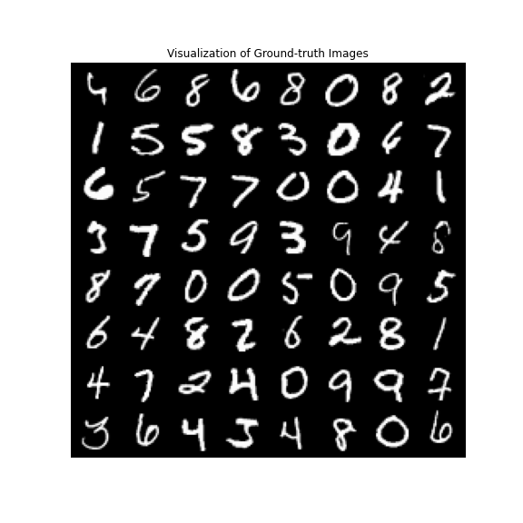
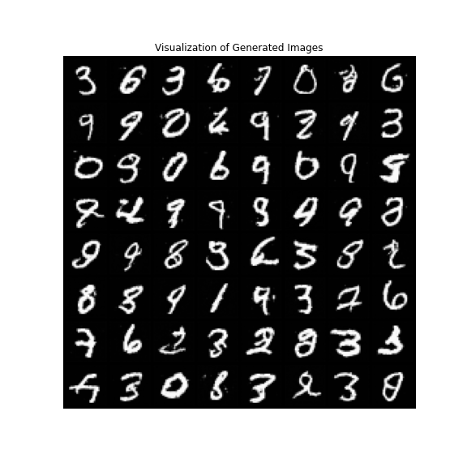

# Pytorch-Diffusion-Model-Tutorial
A simple tutorial of Diffusion Probabilistic Models(DPMs). This repository contains the implementations of following Diffusion Probabilistic Model families.
* [Denoising Diffusion Probabilistic Models](https://arxiv.org/abs/2006.11239) (DDPMs, J. Ho et. al., 2020)
* Other important DPMs will be implemented soon..

# Prerequisites
(1) Download Pytorch and etcs.
* [Anaconda](https://www.anaconda.com/)
* Python=3.9
* [Pytorch](https://pytorch.org/)=1.12.1 with CUDA 11.3

(2) Install dependencies via following command
```
pip install -r requirements.txt
```

# [Expremental Results]
* Due to huge amount of time spent on training, **most of the experiments have been conducted on  MNIST dataset** instead of CIFAR10. In the DDPM paper, 10 + hours spent on training the DDPM model using CIFAR10 dataset and TPU v3-8 (similar to 8 V100 GPUs).
* Used a RTX-3090 GPU for all implementations.

### 01. Denoising Diffusion Probabilistic Models
* trained on MNIST dataset for 100 epochs
* ground-truth samples <br>

* generated samples <br>

* perturbed samples <br>


# References

[1] [Deep Unsupervised Learning using Nonequilibrium Thermodynamics](http://proceedings.mlr.press/v37/sohl-dickstein15.pdf), J. Sohl-Dickstein et. al., Proceedings of the 32nd International Conference on Machine Learning, 2015  
[2] [Denoising Diffusion Probabilistic Models](https://arxiv.org/abs/2006.11239), J. Ho et. al., 34th Conference on Neural Information Processing Systems (NeurIPS 2020), 2020
[3] [lucidrains' pytorch DDPM implementation](https://github.com/ising-diffusion-pytorch)  
[4] [acids-ircam's DDPM tutorials](https://github.com/acids-ircam/diffusion_models)


